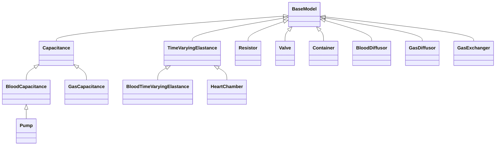

# Model Structure

## Overview
This project is organized around an object-oriented model hierarchy.

- `BaseModel` defines the shared lifecycle (`init_model`, `step_model`, `calc_model`).
- Component models implement physiology/physics behavior in `derived_models`.
- Composition helper functions live in `functions` and are called by components that need blood/gas chemistry updates.

## Core Base Class
- Base class: [base_models/base_model.py](base_models/base_model.py)
- Required behavior:
  - `calc_model(self)` must be implemented by subclasses.
  - `step_model(self)` calls `calc_model(self)` only when `is_enabled` is `True` and model initialization is complete.
  - `init_model(self, args)` supports both dictionary args and JS-style lists of `{key, value}` pairs.
  - `init_model(self, args)` can auto-create and initialize nested components defined in `self.components`.

## Component Models
Folder: [derived_models](derived_models)

### Primary mechanical models
- [base_models/capacitance.py](base_models/capacitance.py): nonlinear pressure-volume capacitance
- [base_models/time_varying_elastance.py](base_models/time_varying_elastance.py): activation-driven elastance chamber
- [base_models/resistor.py](base_models/resistor.py): pressure-driven flow resistance between components
- [base_models/valve.py](base_models/valve.py): directional flow resistance/valve behavior
- [base_models/container.py](base_models/container.py): aggregates contained component volumes and applies external pressure

### Blood-specialized models
- [derived_models/blood_capacitance.py](derived_models/blood_capacitance.py): `Capacitance` + blood composition state (solutes, gases, drugs)
- [derived_models/blood_time_varying_elastance.py](derived_models/blood_time_varying_elastance.py): `TimeVaryingElastance` + blood composition state
- [derived_models/heart_chamber.py](derived_models/heart_chamber.py): `TimeVaryingElastance` chamber with blood composition and ANS-modulated elastance
- [derived_models/blood_diffusor.py](derived_models/blood_diffusor.py): diffusion between two blood components (O2, CO2, solutes)
- [derived_models/pump.py](derived_models/pump.py): blood pump extending blood capacitance with pump pressure coupling

### Gas-specialized models
- [derived_models/gas_capacitance.py](derived_models/gas_capacitance.py): `Capacitance` + gas composition/temperature/humidity handling
- [derived_models/gas_diffusor.py](derived_models/gas_diffusor.py): diffusion between two gas components
- [derived_models/gas_exchanger.py](derived_models/gas_exchanger.py): gas-blood exchange between one blood and one gas component

## Composition Functions
Folder: [functions](functions)

- [functions/blood_composition.py](functions/blood_composition.py): computes blood acid-base and oxygenation state from total contents
- [functions/gas_composition.py](functions/gas_composition.py): computes gas partial pressures/fractions from gas state

## Inheritance Map
- `BaseModel`
  - `Capacitance`
    - `BloodCapacitance`
      - `Pump`
    - `GasCapacitance`
  - `TimeVaryingElastance`
    - `BloodTimeVaryingElastance`
    - `HeartChamber`
  - `Resistor`
  - `Valve`
  - `Container`
  - `BloodDiffusor`
  - `GasDiffusor`
  - `GasExchanger`

## Runtime Interaction Pattern
1. Components are instantiated with `model_ref` and `name`.
2. Properties are populated via `init_model(args)` from model definitions.
3. Simulation loop calls `step_model()` per enabled model.
4. `calc_model()` performs each component’s physics/physiology update.
5. Specialized components call composition helpers when needed:
   - Blood models can call `calc_blood_composition(...)`.
   - Gas models can call `calc_gas_composition(...)`.

## Notes
- `model_ref` is currently used as a component lookup map for cross-component references.
- Diffusors and exchangers rely on `_t` (time-step) being set by the model engine.
- Volume transfer APIs support passing source component context where composition mixing is required.
- Helper translations include `helpers/realtime_moving_average.py`; `ECLS` reuses this shared moving-average helper for flow and pressure smoothing.
